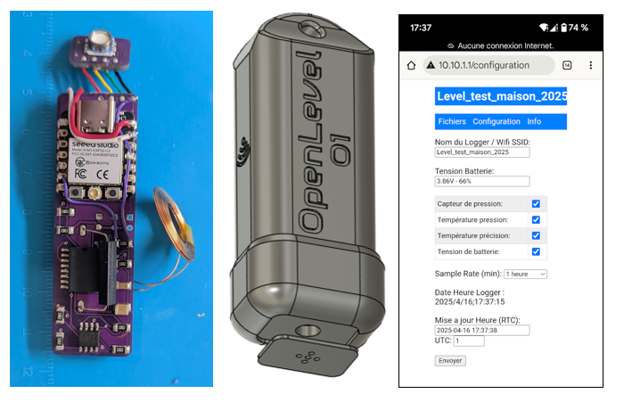

# OpenLEVEL 1.0 ESP32C3

Projet de logger de niveau d'eau OpenLEVEL pour ESP32C3 (compatible Seeed XIAO ESP32C3).

## Description

- Acquisition de pression, température, tension batterie
- Enregistrement sur SPIFFS
- Serveur web embarqué pour configuration et téléchargement
- Compatible DeepSleep et réveil par RTC ou contact REED
- Compatible PlatformIO

## Répertoires

- `01Bars/` : code source principal
- `Typon/` : A venir
- `Typon/` : A venir

## Utilisation

1. Ouvrir ce dossier avec PlatformIO (VSCode)
2. Flasher sur une carte ESP32C3 compatible
3. Configurer via le serveur web embarqué

Université de Bordeaux

